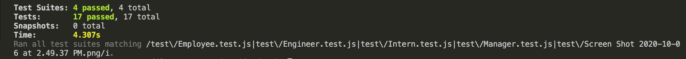
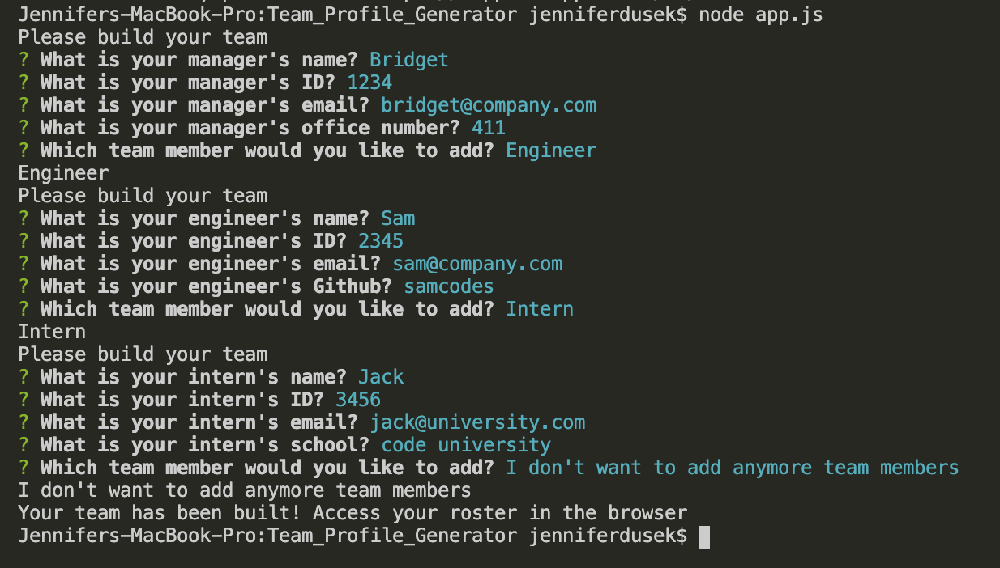
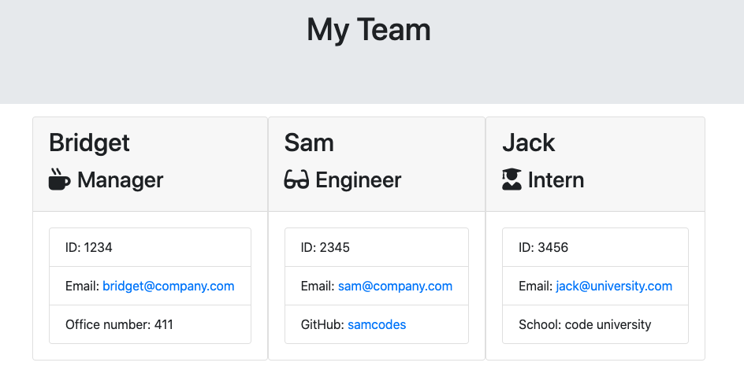

# Team Profile Generator

## Description

The application will prompt the user for information about the team manager and then information about the team members. The user can input any number of team members, and they may be a mix of engineers and interns. This application passes all unit tests. When the user has completed building the team, the application will create an HTML file that displays a nicely formatted team roster based on the information provided by the user.

## Features

All employees will be prompted for the following:

- Name
- ID
- Email

The following roles will be prompted for role-specific information in addition to the general employee information.

Manager

- Office Number

Engineer(s)

- Github

Intern(s)

- School

## Roster Output

The data from the terminal generates `team.html` page in the `output` directory and displays a team roster.

